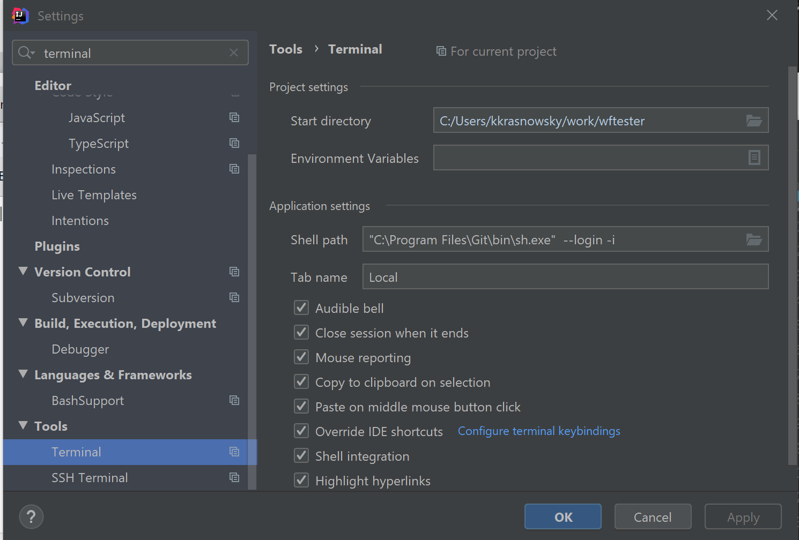

Florida Poly SE Project
===============

Group project for the Software Engineering course [SU A 2020_CEN4010.01 ENGR]. A Sudoku application

## Overview

Sudoku is a logic-based puzzle game where the user must fill out a 9x9 grid with numbers 1-9. 
Each row, column, and sub-grid (3x3 grid within the 9x9) can only contain one of those values.

## Development Instructions
* Install Git Shell/CLI (GitBash: https://git-scm.com/downloads)
* Install IDE (Preferably https://www.jetbrains.com/idea/)
* Install JavaFX (https://openjfx.io/)
    
    **For IntelliJ IDEA**
    
    * Set terminal to use git bash shell
    
        
    
    * Clone repository
        * In IntelliJ: 
        
            Go to _VCS_ &rarr; _Git_ &rarr; _Enter HTTPS link to this repository in 'URL:'_
    

## Authors
   _Brandon Endres, Nicholas Sardano, Vicente Ramos, Scott Swiatek_